# CSV → Shopify Product Import — Step-by-Step Guide

A complete, screenshot-by-screenshot walkthrough of the application, from uploading a CSV to
seeing products live in Shopify. **Every screenshot below is a real capture of the running
application** (captured 2026-06-18 against the live Shopify sandbox `laravel-import-test`).

This guide is written for a non-technical reviewer — you can follow it top to bottom to understand
exactly what the system does and how each requirement is met.

---

## What this application does (in one paragraph)

You upload a Shopify-style **product CSV**. The app validates the file (in the browser *and* on the
server), stores it, and creates a database record for every row. A **background queue** then imports
each product into a Shopify store via the **Admin GraphQL API** — creating the product, its variant
(price, SKU, weight, inventory policy), setting inventory at a location, attaching the image, and
adding it to the target collection. The whole time, a **live dashboard** shows each product moving
through `pending → processing → successful / failed`, with full logging, an in-app log viewer, and
failure notifications. Re-uploading the same file **updates** the existing products instead of
creating duplicates.

---

## Architecture at a glance

```
Browser (Vue 3 + Inertia + PrimeVue)
   │  upload CSV
   ▼
UploadController ──► StoreUploadRequest (validate type, size, required headers)
   │
   ▼
CsvImportService ──► parse + per-row validation + duplicate detection
   │                 → 1 Upload row + N Product rows (pending / failed / skipped)
   ▼
database queue ──► ProcessCsvImport ──► one ImportProductToShopify job per product
                                          │
                                          ▼
                                   ShopifyService (GraphQL)
                                   create | update → variant → inventory → image → collection
                                          │
                                          ▼
                              status + Shopify IDs + logs + notifications
```

---

## Step 1 — The upload page

Open the app at **http://localhost:8000**. You land on the import page.

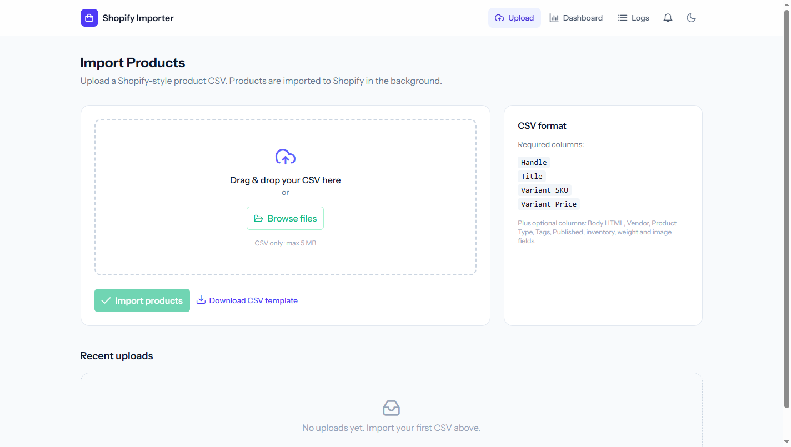

- A clear **drag-and-drop dropzone** (or *Browse files*).
- A **format guide** on the right listing the required columns (`Handle`, `Title`, `Variant SKU`,
  `Variant Price`) and the optional ones.
- A **Download CSV template** link so the client always has a correctly-formatted starting point.
- The top navigation: **Upload · Dashboard · Logs**, a **notification bell**, and a **dark-mode** toggle.

---

## Step 2 — Select a CSV

Drop in (or browse to) the sample file. The app shows the **file name and size**, and the *Import
products* button becomes active.

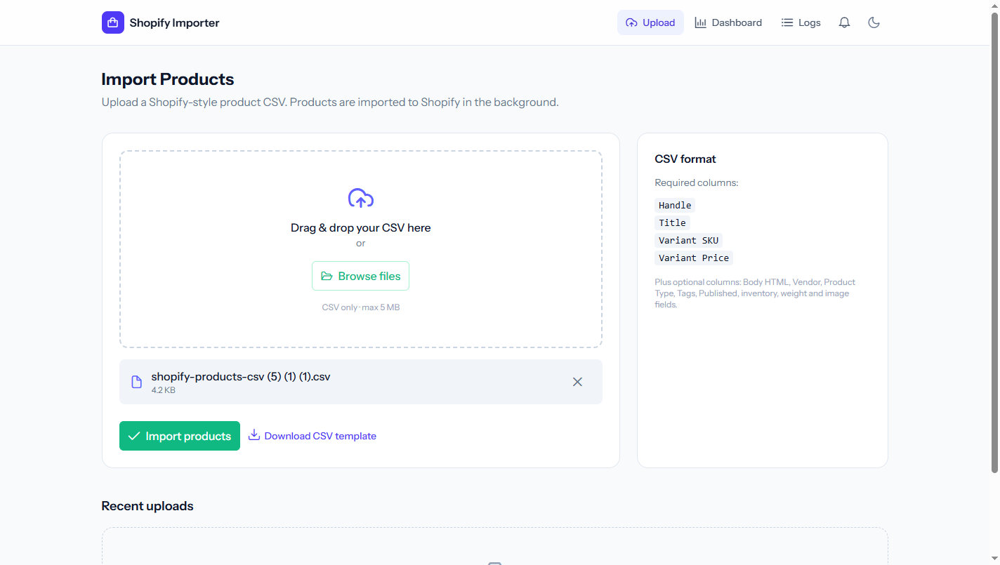

> The sample file `shopify-products-csv (5) (1) (1).csv` contains **10 valid products**.

---

## Step 3 — Client-side validation

If you pick the wrong kind of file (or one that's too big or empty), the app rejects it **instantly
in the browser**, before anything is uploaded:

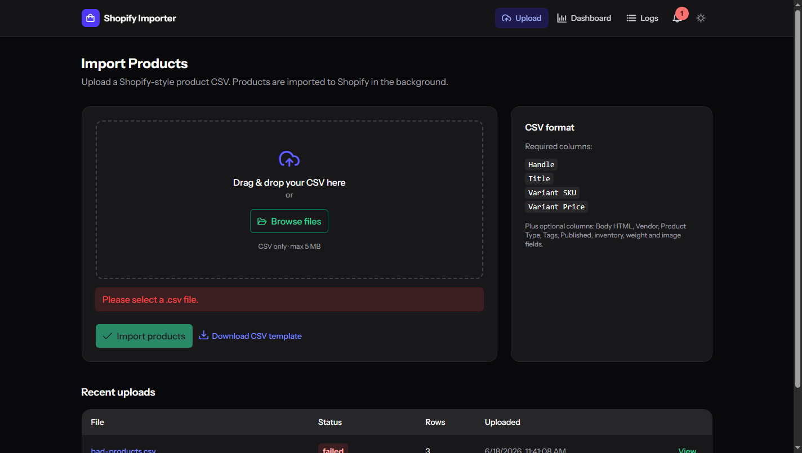

> *“Please select a .csv file.”* — Client-side validation checks the **file type** (`.csv` only) and
> **size** (≤ 5 MB) and rejects empty files. The server then re-validates everything independently and
> additionally confirms the **required column headers** exist.

---

## Step 4 — Upload & live processing

Click **Import products**. You get a success toast — *“Upload received — 10 rows queued for import”* —
and land on the **detail page**, which immediately starts tracking progress.

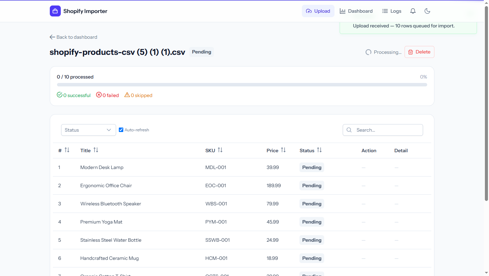

- A **progress bar** (`0 / 10 processed`) and live counters: *successful / failed / skipped*.
- A per-product table: **row #, Title, SKU, Price, Status, Action, Detail**.
- **Auto-refresh** is on — the page polls every few seconds and updates without a manual refresh.

---

## Step 5 — Completion

Within a few seconds every product reaches a terminal state and the upload is marked **Completed**.

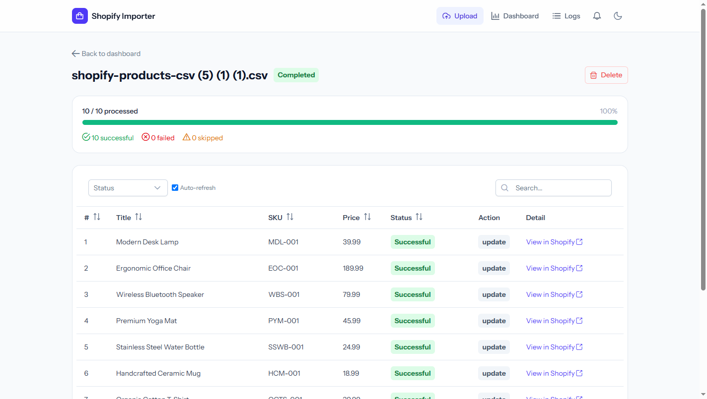

- `10 / 10 processed · 100%` — **10 successful, 0 failed, 0 skipped**.
- The **Action** column shows `update` here because these products already exist in the Shopify
  sandbox from earlier runs — the system **matched and updated them instead of creating duplicates**
  (this is the *update-existing / upsert* feature). On a fresh store these would read `create`.
- **View in Shopify** links open each product directly in the Shopify admin.

---

## Step 6 — The dashboard

The **Dashboard** gives the high-level overview of every import.

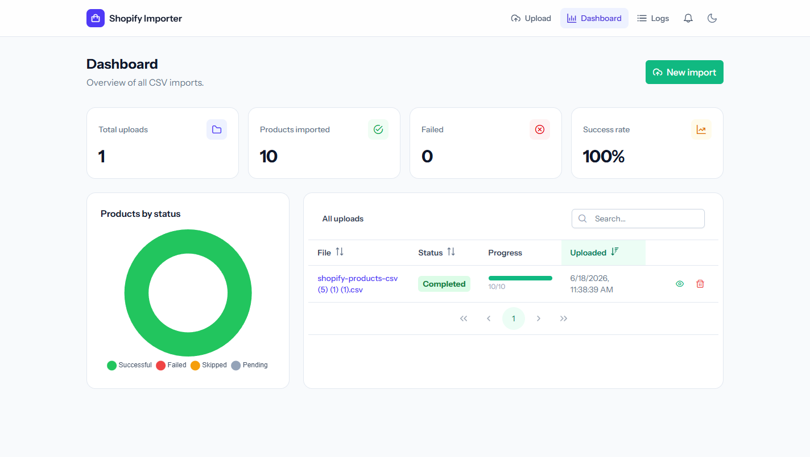

- **Stat cards:** Total uploads, Products imported, Failed, Success rate.
- A **“Products by status” donut chart**.
- An **All uploads** table with search, sortable columns, pagination, a per-upload **progress bar**,
  and **view / delete** actions.

---

## Step 7 — The log viewer

Every import event is recorded. The **Logs** page is an in-app viewer over those records.

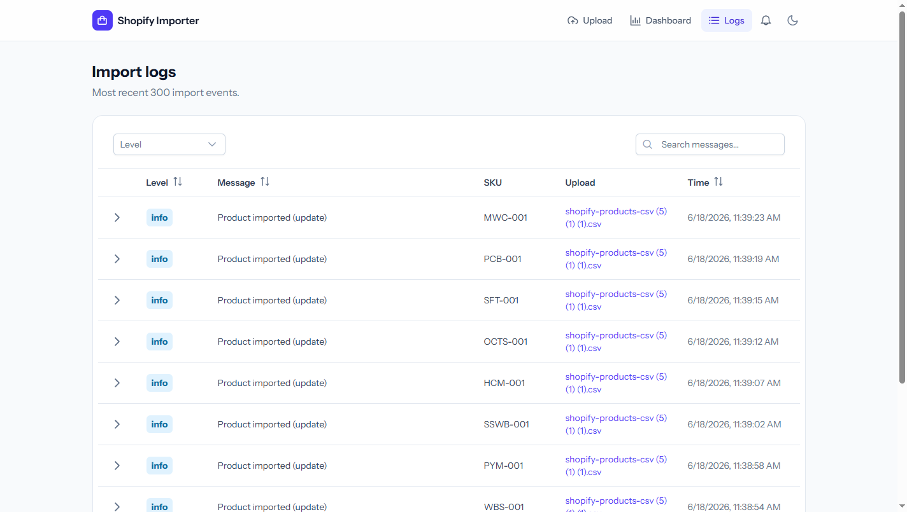

You can **filter by level** and **search messages**. Each row expands to reveal the full **JSON
context** captured for that event:

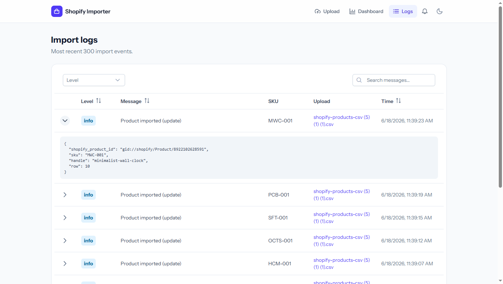

> The expanded context shows the Shopify product GID, SKU, handle, and row number — exactly what was
> sent/received for that product.

---

## Step 8 — Validation & failure handling

Now upload a deliberately **bad CSV** (`docs/sample-csv/bad-products.csv`) — a row with a non-numeric
price, a row with a missing handle, and a row with a missing title.

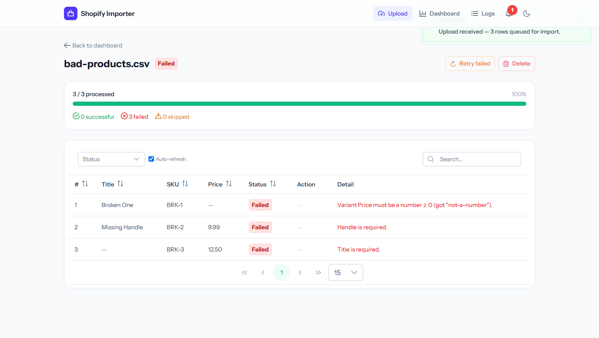

- The upload is marked **Failed**; the counters read **0 successful, 3 failed**.
- **Each row carries a precise, human-readable error**:
  - *“Variant Price must be a number ≥ 0 (got "not-a-number").”*
  - *“Handle is required.”*
  - *“Title is required.”*
- Validation is **per-row** — one bad row never aborts the whole file.
- Note the **notification bell** now shows a red unread badge, and **Retry failed** / **Delete**
  actions appear.

---

## Step 9 — Failure notifications

Click the **bell**. An in-app, database-backed notification summarises the failure:

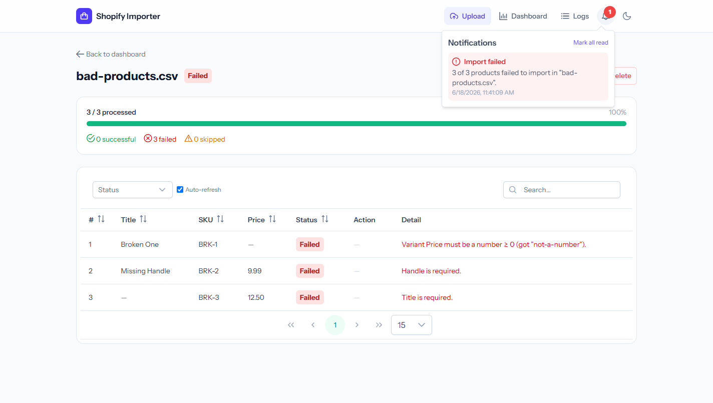

> *“Import failed — 3 of 3 products failed to import in "bad-products.csv".”* with a timestamp and a
> **Mark all read** action.

---

## Step 10 — Dark mode

The whole application has a polished **dark theme**, toggled from the top-right and remembered between
visits. Here is the dashboard after both imports (note the success rate dropped to 77% and the chart
now shows the failed slice in red):

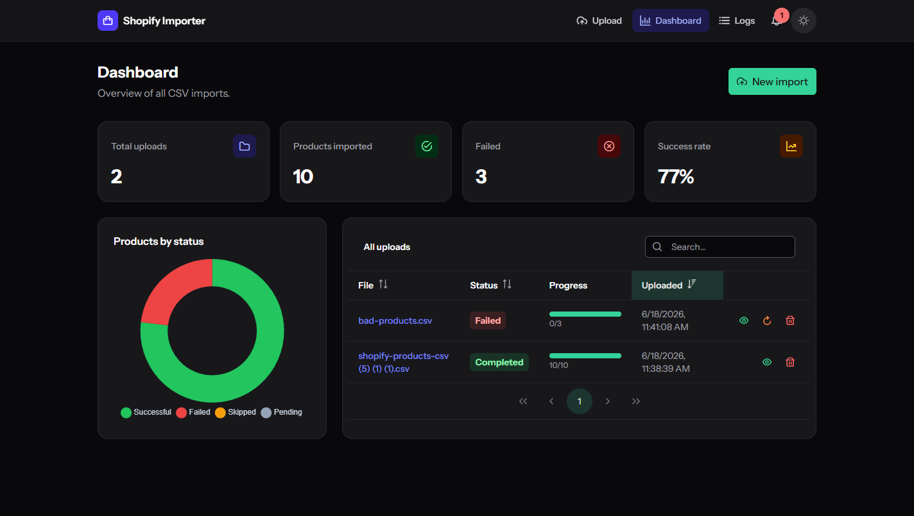

---

## How each requirement is demonstrated above

| Requirement | Shown in |
|---|---|
| CSV upload form, clean responsive UI | Steps 1–2 |
| Client-side validation (type & size) | Step 3 |
| Server-side validation + required headers | Steps 3–4, 8 |
| Asynchronous (queued) processing | Steps 4–5 |
| Per-product status (pending→processing→successful/failed) | Steps 4–5 |
| Shopify integration via **GraphQL** (create/variant/inventory/image) | Step 5 |
| Add to required collection `464337174767` | Step 5 (`successful` + “View in Shopify”) |
| **Update existing product (upsert)** | Step 5 (`update` action) |
| Dashboard with all imports, stats, chart, search/sort/paginate | Step 6 |
| Error messages for failed rows | Step 8 |
| **Logging + in-app log viewer** | Step 7 |
| **Error notification system** | Steps 8–9 |
| Retry & delete | Steps 6, 8 |
| Dark mode / world-class UI polish | Step 10 (and all) |

For the full requirement-by-requirement mapping to source files, see
**[CLIENT_REQUIREMENTS.md](CLIENT_REQUIREMENTS.md)**.

---

## Reproduce this walkthrough yourself

```bash
# 1. Build assets and migrate
npm run build
php artisan migrate            # or: php artisan migrate:fresh  (clean slate)

# 2. Verify Shopify is connected (token, location, collection)
php artisan shopify:check

# 3. Start the two processes (separate terminals)
php artisan serve              # → http://localhost:8000
php artisan queue:work         # processes the imports

# 4. Open http://localhost:8000 and follow Steps 1–10 above.
```

Sample files used in this guide:
- **Valid:** `plan/shopify-products-csv (5) (1) (1).csv` (10 products)
- **Invalid (for the failure demo):** `docs/sample-csv/bad-products.csv`

> For a narrated video version of this exact flow, see **[DEMO_VIDEO.md](DEMO_VIDEO.md)**.
